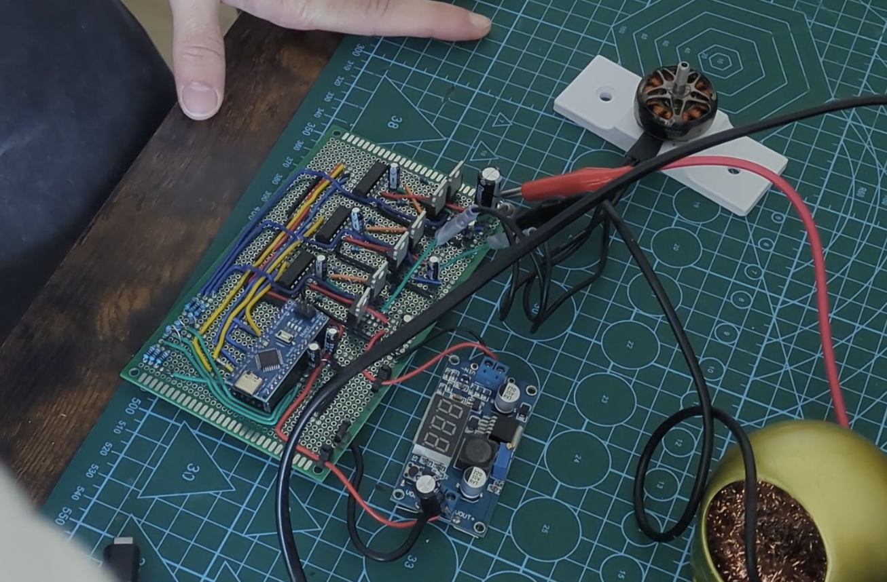

# HOLY ESC

A simple Atmega328p based (Arduino nano) ESC design using BEMF to close the loop.

> [!CAUTION]
> This repo is **WORK IN PROGRESS** and **MAY CAUSE FIRES THAT WILL DESTROY EVERYTHING YOU OWN**.

## Software

The software folder contains the arduino nano firmwares I use for my ESC demos.

These firwares are 100% custom are the result of hours of trial and error. They are also NOT the result of LLM work. I tried using LLMs but hey failed miserably and made me lose hours on end.

### Open loop

This firmware focuses on making a motor spin without BEMF. Ideal to test your circuit.

It makes the motor spins at a fixed & relatively low speed dn ramps up towards a slightly higher speed, but nothing fancy really.

### Closed loop

The closed loop firmware is the result of a lot of trial and error, so it's a bit tangled. But here are the important thing to know to understand this firmware.

The firmware start in an open loop, meanning `TIMER1_COMPA_vect` will handle the steps.

Then, 

## Hardware

This folder allows you to build your own hardware, either on a prototype board OR just get a PCB.

### Perfboard

You will find a PDF for the schematics and a BOM to build your own perfboard prototype.

### Kicad

There, you will find kicad files for the actual PCB.