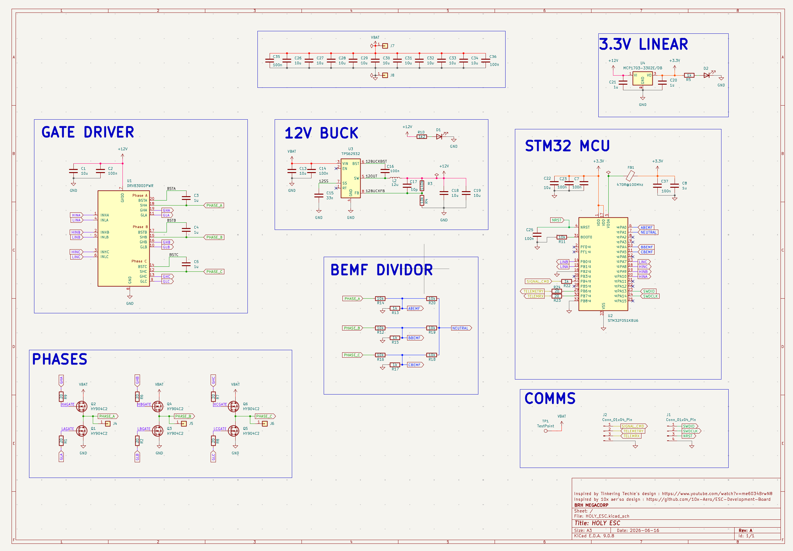
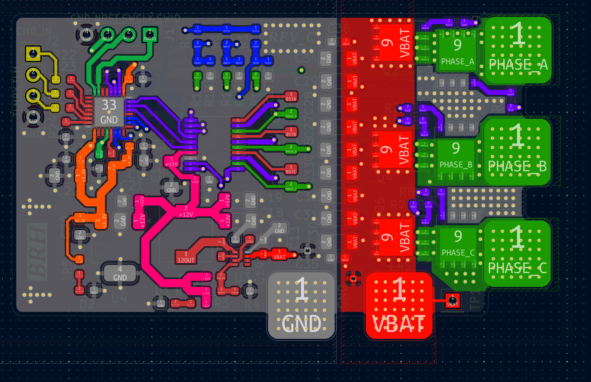
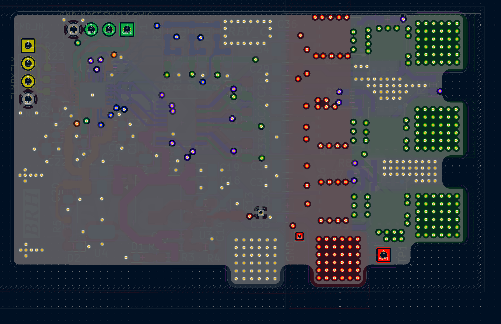
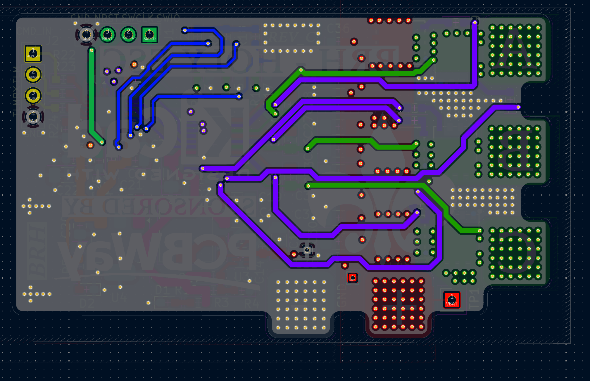
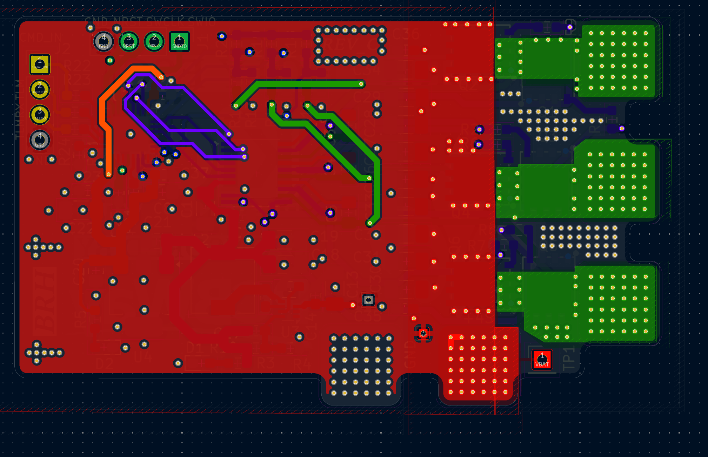
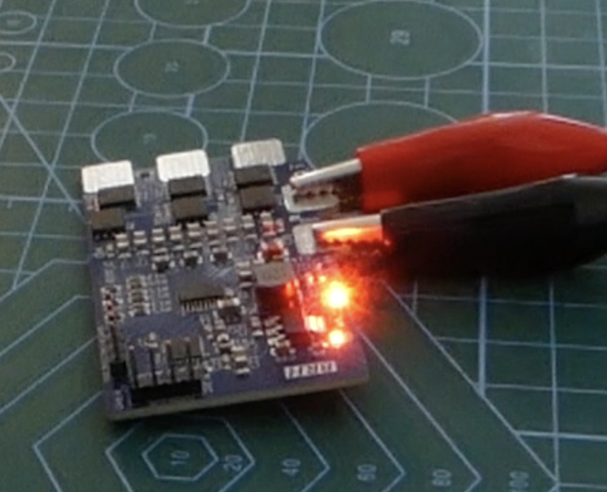
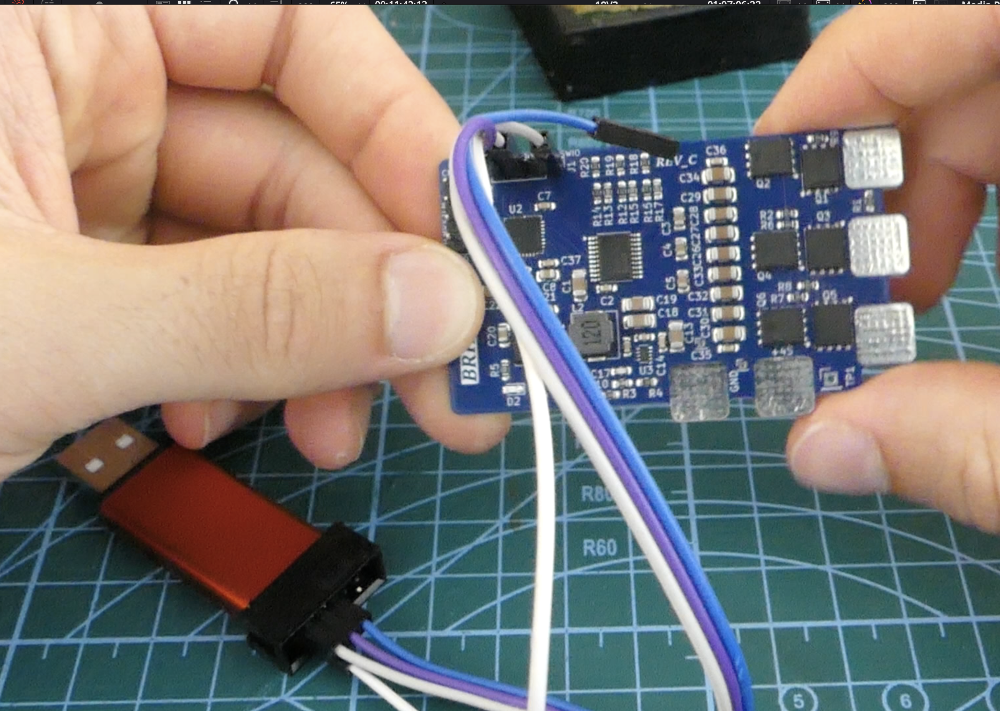

# HOLY ESC

My effort to bring an open source, closed loop ESC to life.

From hardware to firmware.

> This image was edited using AI to remove stickers that were bloating the image.

You can order the **FULL BUILD** in a couple of click right : (Todo : add link once project post is approved)

> [!NOTE]  
> This ESC was featured in one of my youtube videos. You may be searching for the AtMega based firmware and perfboard BOM / Schematics. I did not put these here as the design worked but is not reliable. You can open an issue if you really want it and I'll add it to some "deprecated" folder in the repo.

## THE PROJECT

The HOLY ESC is a BACK EMF based ESC, theorically able to be loaded up to 25Amps and more. But it serve educational purupses and has not be stress tested for any applications yet.

It was designed on KiCad 9 and aims at using cheap components to make the design accessible to all.

This design target drones and is planned to be tested on such applications soon.

Here are views of the PCB layers:

## Usage

### Hardware

The hardware folder contains the KiCad9 files that you can open and modify as you like for your own needs, as long as you respect the project licence at the root of this repo.

### Sofware

The sofware part is a bit more tricky.

If you get the board manufactured, you will need to load a firmware on it. In this repo, I distribute AM32 binaries made specifically for this ESC.

Here is the procedure to start spinning a motor:

**1. Connect the HOLY ESC to your host PC**

First you'll need to connect the ESC's STM32 to a host computer.

So you'll need :

- A 15V or so power supply to power the board.
- A Stlink V2 (or any clone should work as long as it has SWD)
- Download STM32CUBE programmer software

So connect the ESC to your power supply, I suggest limiting max current to 1 Amp in case a fault arises. Red LEDS should turn on.

Connect the ESC SWD headers to you STLINK

And plug it into you computer.

Launch STMCUBE Programmer, click connect and it should recognze the MCU on the ESC board.

**2. Load the Firmware**

To load the firmware, you have to load a coouple things. The procedure is describe here pretty well :

[https://github-wiki-see.page/m/AlkaMotors/AM32-MultiRotor-ESC-firmware/wiki/Memory-Layout-for-flashing-with-a-St-link?utm_source=chatgpt.com](https://github-wiki-see.page/m/AlkaMotors/AM32-MultiRotor-ESC-firmware/wiki/Memory-Layout-for-flashing-with-a-St-link?utm_source=chatgpt.com)

Youn can use STMCube's "Erasing and Programming" tab to select a binary and load it to a specified address. Just load each binary at the right address and you should be good to go.

> To verify if you corectyly modified a memory region, you cna use the "Memory and File editing tab" to read a specific memory region, to check if it changed from the default values.

Bootloading and eeprom binaries are found in the page linked above. **You will find the specific binary built for this specific board in `./software/`**

> [!TIP]  
> If you are hardstuck on trying to lad a firmware, you can open an issue to get support.

## Future Work

- Replace the STM32F051 with a cheaper and more available package / version. (right now its 5+$ !!!! When I made the design it was like for 3-4$ MAX before going out of stock on LCSC)
- Add vias under the FETs as well. I did not initially did so to avoid assembly problems but adding a few vias on the mosfet pad should drastically increase Amperage tolerance.

## Inspirations & Thanks

A big thank you to these actors, who were a great source of inspiration in my learning and designing process !

- [The Engineering Techie](https://www.youtube.com/watch?v=1ThH9cA4eWE&t=8s)
- [Electronoobs](https://www.youtube.com/watch?v=8LXPcJD6hEA)
- [10x Aero](https://github.com/10x-Aero/ESC-Development-Board/tree/main)
- AM32 Community and posts

## Self Promotion

- The youtube channel which I featured this project on : [BRH YOUTUBE](https://www.youtube.com/@BRH_SoC)
- My Blog : [Blog Link](https://hugobrh.dev)